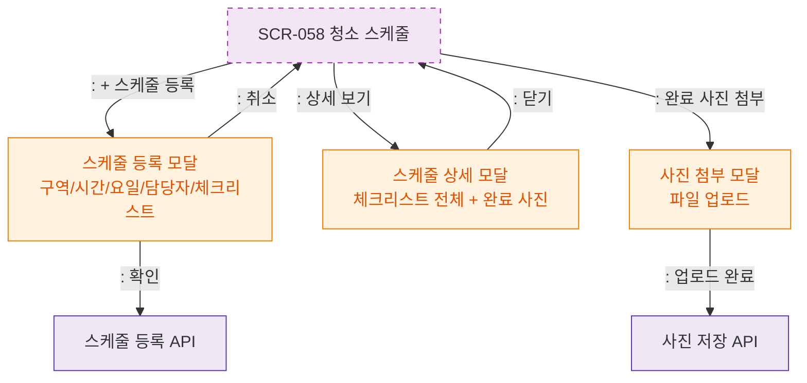

# F5 모달 트리거 트리 — SCR-058 청소 스케줄 🆕

## 다이어그램

```mermaid
flowchart TD
    SCR_058[SCR-058 청소 스케줄]

    SCR_058 -->|": + 스케줄 등록"|AddModal[스케줄 등록 모달\n구역/시간/요일/담당자/체크리스트]
    SCR_058 -->|": 상세 보기"|DetailModal[스케줄 상세 모달\n체크리스트 전체 + 완료 사진]
    SCR_058 -->|": 완료 사진 첨부"|PhotoModal[사진 첨부 모달\n파일 업로드]

    AddModal -->|": 확인"|AddAPI[스케줄 등록 API]
    AddModal -->|": 취소"|SCR_058
    DetailModal -->|": 닫기"|SCR_058
    PhotoModal -->|": 업로드 완료"|PhotoAPI[사진 저장 API]

    classDef newFeature fill:#F3E5F5,stroke:#9C27B0,stroke-dasharray:5 5
    classDef modal fill:#FFF3E0,stroke:#F57C00,color:#E65100
    classDef system fill:#EDE7F6,stroke:#5E35B2
    class SCR_058 newFeature
    class AddModal,DetailModal,PhotoModal modal
    class AddAPI,PhotoAPI system
```

## TC 후보

| TC ID | 타입 | Given | When | Then | |-------|------|-------|------|------| | TC-058-005 | positive | SCR-058 | + 스케줄 등록 클릭 | 스케줄 등록 모달 열림 |
