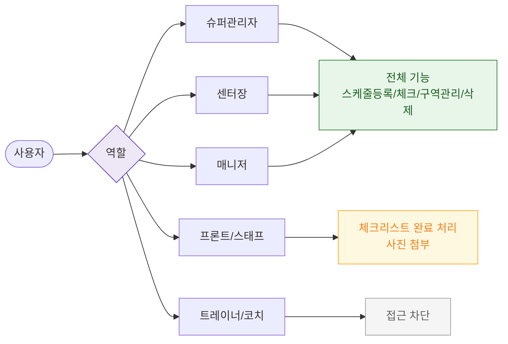

# F7 권한(RBAC) 분기 플로우 — SCR-058 청소 스케줄 🆕

## 다이어그램

```mermaid
flowchart LR
    USER([사용자]) --> RoleCheck{역할}

    RoleCheck --> P[슈퍼관리자]
    RoleCheck --> O[센터장]
    RoleCheck --> M[매니저]
    RoleCheck --> F[프론트/스태프]
    RoleCheck --> T[트레이너/코치]

    P & O & M --> Full[전체 기능\n스케줄등록/체크/구역관리/삭제]
    F --> Limited[체크리스트 완료 처리\n사진 첨부]
    T --> Blocked[접근 차단]

    classDef success fill:#E8F5E9,stroke:#2E7D32,color:#1B5E20
    classDef warning fill:#FFF8E1,stroke:#F9A825,color:#F57F17
    classDef rbacBlocked fill:#F5F5F5,stroke:#9E9E9E,color:#616161
    classDef system fill:#EDE7F6,stroke:#5E35B2
    class Full success
    class Limited warning
    class Blocked rbacBlocked
    class RoleCheck system
```

## TC 후보

| TC ID | 타입 | Given | When | Then | |-------|------|-------|------|------| | - | - | - | - | - |
