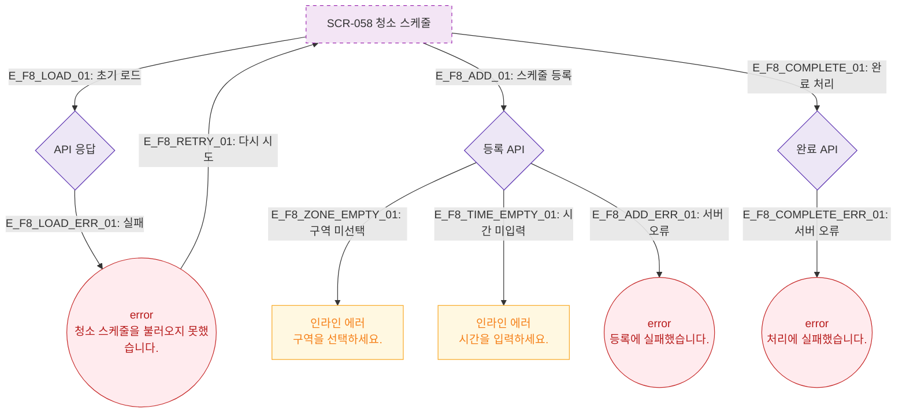

# F8 에러/예외/복구 플로우 — SCR-058 청소 스케줄 🆕

## 다이어그램

## TC 후보

| TC ID | 타입 | Given | When | Then |
|-------|------|-------|------|------|
| TC-058-004 | negative | 스케줄 등록 | 구역 미선택 저장 | 인라인 에러 "구역을 선택하세요." |
