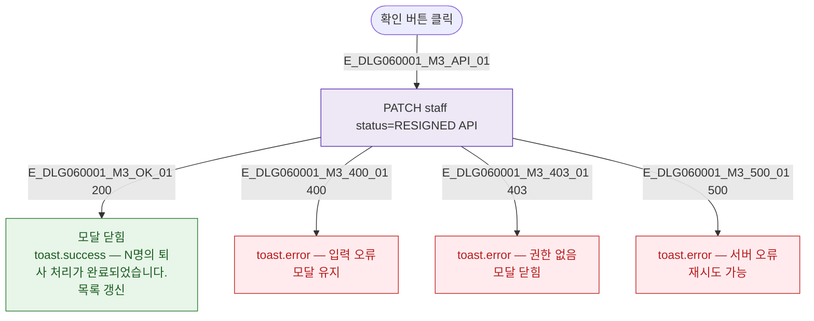

## 3. 다이어그램

## 5. TC 후보

| TC ID | 타입 | Given | When | Then |
|-------|------|-------|------|------|
| TC-DLG060001-M3-01 | positive | 확인 텍스트 일치 | 확인 클릭 | 퇴사 처리 성공 토스트 + 닫힘 |
| TC-DLG060001-M3-02 | exception | 확인 클릭 | API 500 | 서버 오류 토스트, 모달 유지 |
| TC-DLG060001-M3-03 | negative | manager | 확인 클릭 | 권한 없음 토스트 |
