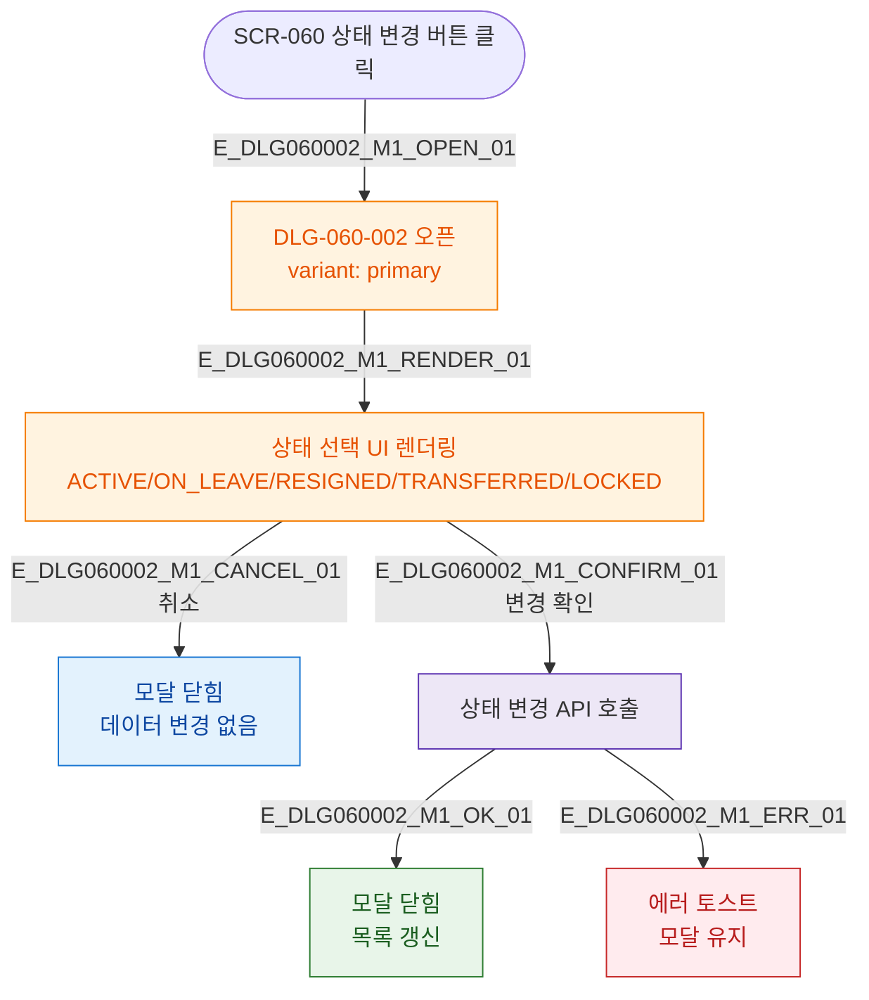

## 3. 다이어그램

## 5. TC 후보

| TC ID | 타입 | Given | When | Then |
|-------|------|-------|------|------|
| TC-DLG060002-M1-01 | positive | 상태 변경 버튼 | 클릭 | 모달 오픈 |
| TC-DLG060002-M1-02 | positive | 모달 오픈 | 취소 | 닫힘, 변경 없음 |
| TC-DLG060002-M1-03 | positive | 상태 선택 | 변경 확인 | 상태 변경 성공 + 닫힘 |
