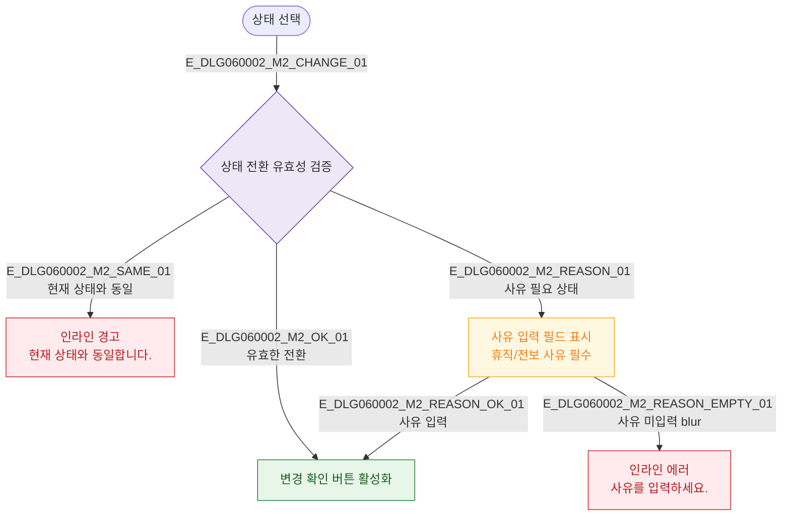

## 3. 다이어그램

## 5. TC 후보

| TC ID | 타입 | Given | When | Then |
|-------|------|-------|------|------|
| TC-DLG060002-M2-01 | positive | 상태 선택 | ON_LEAVE 선택 | 사유 입력 필드 표시 |
| TC-DLG060002-M2-02 | negative | 상태 선택 | 현재 상태 동일 선택 | 동일 상태 경고 |
| TC-DLG060002-M2-03 | negative | ON_LEAVE 선택 | 사유 미입력 | 사유 필수 에러 |
