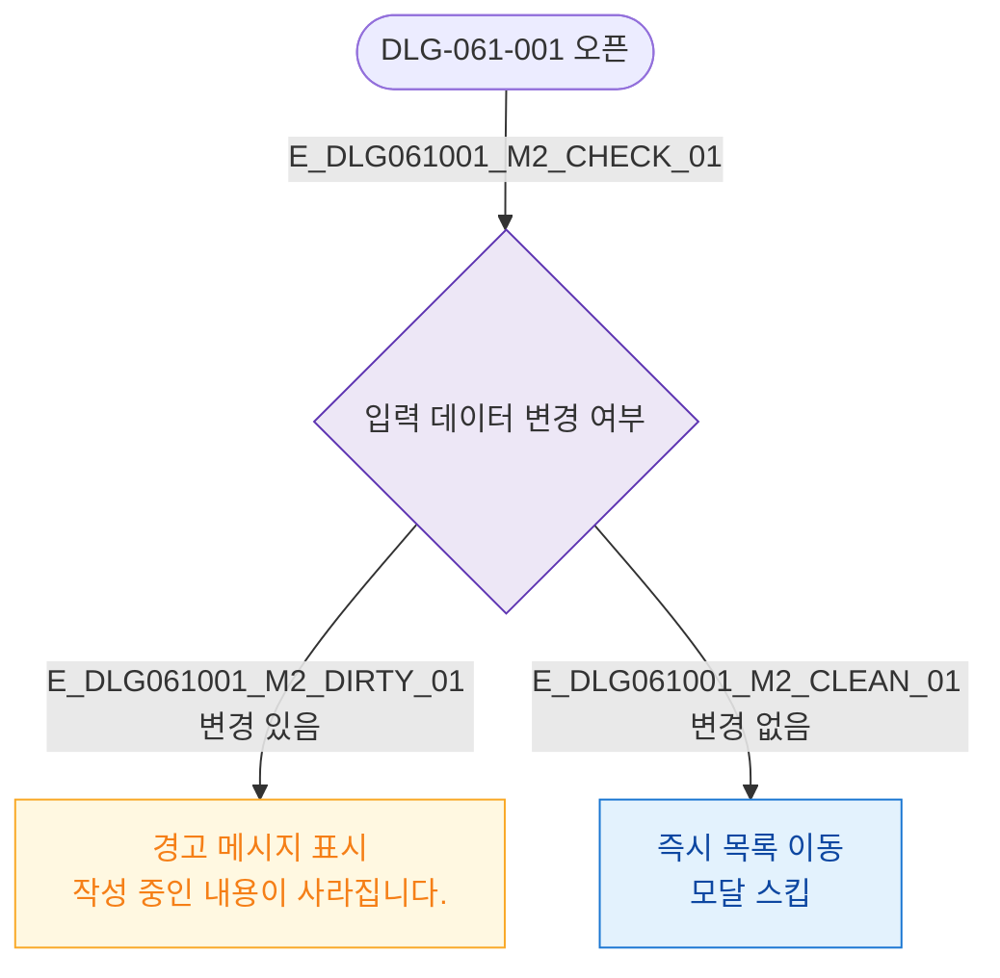

## 3. 다이어그램

## 5. TC 후보

| TC ID | 타입 | Given | When | Then |
|-------|------|-------|------|------|
| TC-DLG061001-M2-01 | positive | 입력 데이터 있음 | 취소 클릭 | 경고 메시지 포함 모달 표시 |
| TC-DLG061001-M2-02 | positive | 입력 데이터 없음 | 취소 클릭 | 모달 없이 즉시 목록 이동 |
