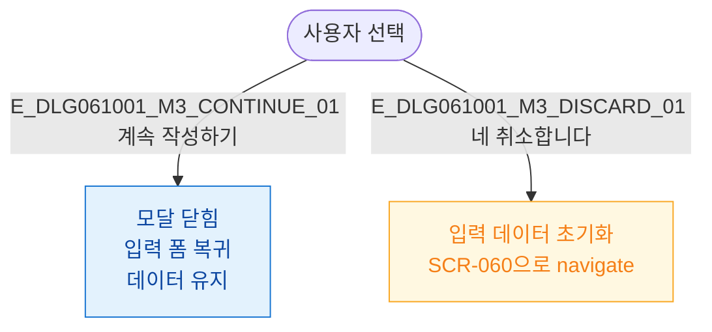

## 3. 다이어그램

## 5. TC 후보

| TC ID | 타입 | Given | When | Then |
|-------|------|-------|------|------|
| TC-DLG061001-M3-01 | positive | 모달 표시 | 계속 작성하기 | 폼 복귀, 데이터 유지 |
| TC-DLG061001-M3-02 | positive | 모달 표시 | 네 취소합니다 | 목록 이동, 데이터 폐기 |
