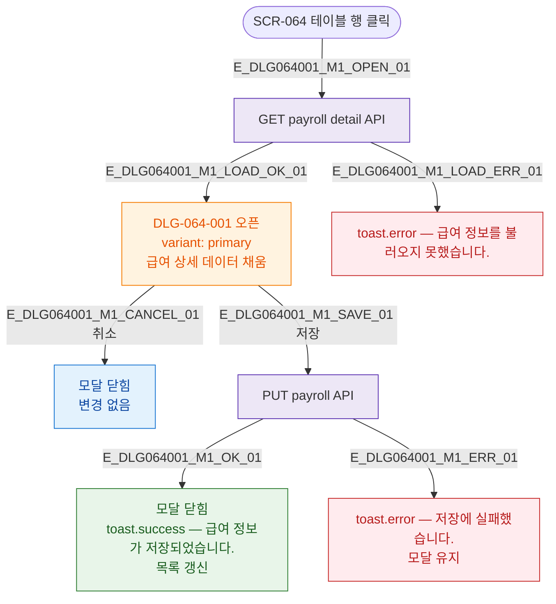

## 3. 다이어그램

## 5. TC 후보

| TC ID | 타입 | Given | When | Then |
|-------|------|-------|------|------|
| TC-DLG064001-M1-01 | positive | 급여 행 클릭 | 로드 성공 | 모달 오픈 + 데이터 채움 |
| TC-DLG064001-M1-02 | positive | 모달 오픈 | 취소 | 닫힘, 변경 없음 |
| TC-DLG064001-M1-03 | positive | 수당 수정 후 | 저장 | 성공 토스트 + 닫힘 |
| TC-DLG064001-M1-04 | exception | 행 클릭 | API 500 | 로드 실패 토스트 |
