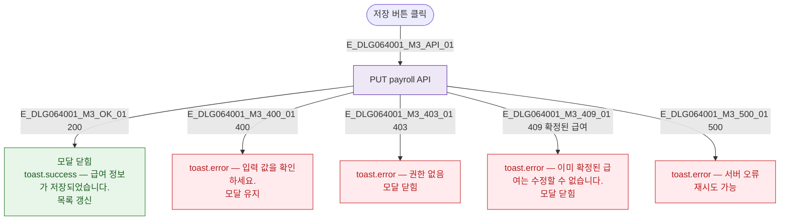

## 3. 다이어그램

## 5. TC 후보

| TC ID | 타입 | Given | When | Then |
|-------|------|-------|------|------|
| TC-DLG064001-M3-01 | positive | 유효한 수당 입력 | 저장 | 성공 토스트 + 닫힘 |
| TC-DLG064001-M3-02 | negative | 확정된 급여 | 저장 시도 | 409 에러 토스트 |
| TC-DLG064001-M3-03 | exception | 저장 클릭 | API 500 | 서버 오류 토스트, 모달 유지 |
