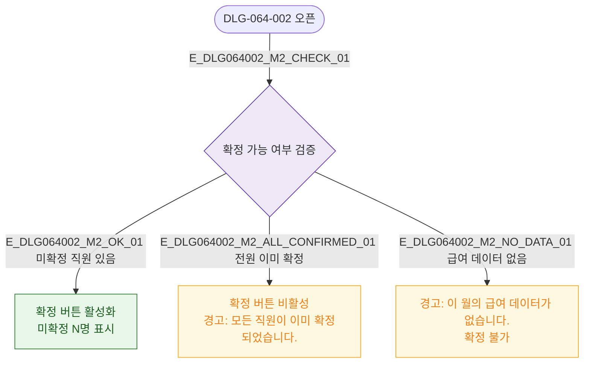

## 3. 다이어그램

## 5. TC 후보

| TC ID | 타입 | Given | When | Then |
|-------|------|-------|------|------|
| TC-DLG064002-M2-01 | positive | 미확정 직원 있음 | 모달 오픈 | 확정 버튼 활성 + 인원 수 표시 |
| TC-DLG064002-M2-02 | negative | 전원 이미 확정 | 모달 오픈 | 확정 버튼 비활성 + 경고 |
| TC-DLG064002-M2-03 | negative | 급여 데이터 없음 | 모달 오픈 | 확정 불가 경고 |
