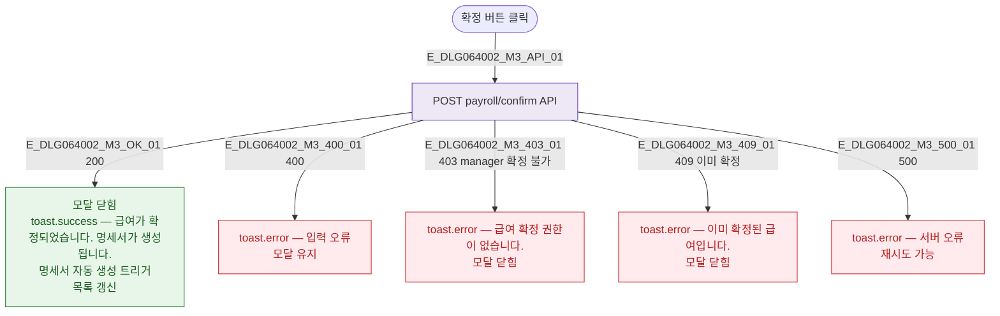

## 3. 다이어그램

## 5. TC 후보

| TC ID | 타입 | Given | When | Then |
|-------|------|-------|------|------|
| TC-DLG064002-M3-01 | positive | 미확정 급여 | 확정 클릭 | 성공 토스트 + 명세서 생성 + 닫힘 |
| TC-DLG064002-M3-02 | negative | manager 역할 | 확정 클릭 | 권한 없음 토스트 |
| TC-DLG064002-M3-03 | negative | 이미 확정된 급여 | 확정 클릭 | 409 에러 토스트 |
| TC-DLG064002-M3-04 | exception | 확정 클릭 | API 500 | 서버 오류 토스트, 재시도 |
