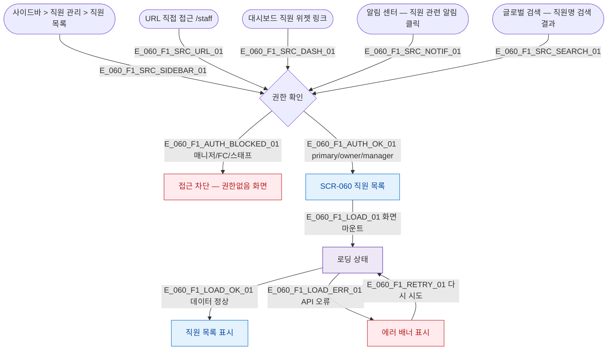

## 1. 목적

SCR-060 직원 목록 화면에 진입할 수 있는 모든 경로를 명세한다. 진입 TC의 Given 조건 원천.

## 2. 전제조건

- 사용자가 로그인 상태이다.
- 세션이 유효하다.
- 접근 가능 역할: primary(슈퍼관리자), owner(최고관리자), manager(센터장). 매니저/FC/스태프는 접근 불가.

## 3. 다이어그램

## 4. 엣지 설명 테이블

| 엣지 ID | 출발 | 도착 | 라벨 / 조건 |
|---------|------|------|-------------|
| E_060_F1_SRC_SIDEBAR_01 | 사이드바 | 권한 확인 | 사이드바 직원 목록 클릭 |
| E_060_F1_SRC_URL_01 | URL | 권한 확인 | /staff 직접 접근 |
| E_060_F1_SRC_DASH_01 | 대시보드 위젯 | 권한 확인 | 대시보드 직원 위젯 클릭 |
| E_060_F1_SRC_NOTIF_01 | 알림 센터 | 권한 확인 | 직원 관련 알림 클릭 |
| E_060_F1_SRC_SEARCH_01 | 글로벌 검색 | 권한 확인 | 직원명 검색 결과 클릭 |
| E_060_F1_AUTH_BLOCKED_01 | 권한 확인 | 접근 차단 | 매니저/FC/스태프 역할 |
| E_060_F1_AUTH_OK_01 | 권한 확인 | SCR-060 | primary/owner/manager 역할 |
| E_060_F1_LOAD_01 | SCR-060 | 로딩 | 화면 마운트 후 데이터 요청 |
| E_060_F1_LOAD_OK_01 | 로딩 | 목록 표시 | API 정상 응답 |
| E_060_F1_LOAD_ERR_01 | 로딩 | 에러 배너 | API 오류 |
| E_060_F1_RETRY_01 | 에러 배너 | 로딩 | 다시 시도 클릭 |

## 5. TC 후보

| TC ID | 타입 | Given | When | Then |
|-------|------|-------|------|------|
| TC-060-F1-01 | positive | owner 로그인 | 사이드바 > 직원 목록 클릭 | SCR-060 정상 진입, 목록 표시 |
| TC-060-F1-02 | positive | owner 로그인 | /staff URL 직접 접근 | SCR-060 정상 진입 |
| TC-060-F1-03 | negative | fc 로그인 | /staff URL 접근 시도 | 접근 차단 화면 표시 |
| TC-060-F1-04 | negative | staff 로그인 | 사이드바 직원 목록 클릭 | 접근 차단 화면 표시 |
| TC-060-F1-05 | positive | owner 로그인 | 대시보드 직원 위젯 클릭 | SCR-060 진입 |
| TC-060-F1-06 | exception | owner 로그인 | 진입 중 API 오류 | 에러 배너 표시, 다시 시도 가능 |
