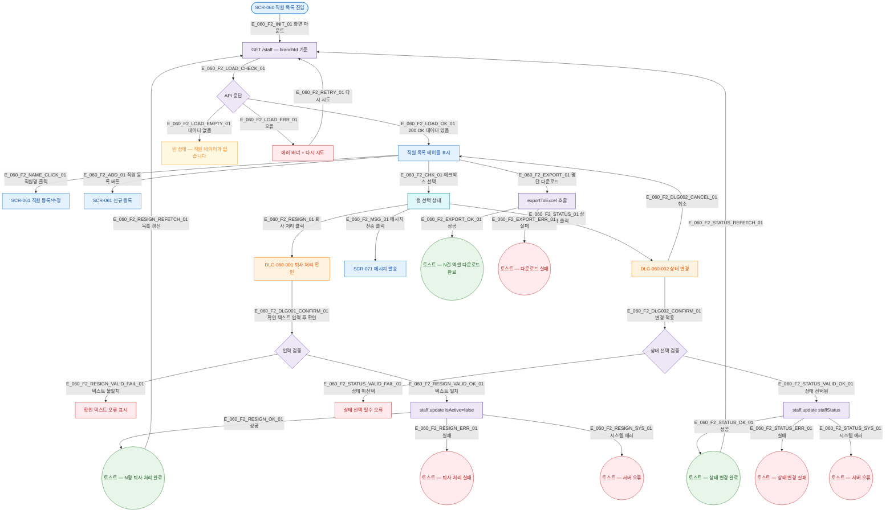

## 1. 목적

SCR-060 정상 시나리오(Happy Path). 진입→목록 조회→선택→액션(퇴사/상태변경/메시지/다운로드) 전체 흐름. 성공/검증실패/시스템에러 3갈래 분기 강제.

## 2. 전제조건

- primary/owner/manager 로 로그인되어 있다.
- SCR-060에 진입 완료 후 데이터 로드 성공 상태이다.

## 3. 다이어그램

## 4. 엣지 설명 테이블

| 엣지 ID | 출발 | 도착 | 라벨 / 조건 |
|---------|------|------|-------------|
| E_060_F2_INIT_01 | SCR-060 | API 호출 | 화면 마운트 |
| E_060_F2_LOAD_OK_01 | API 응답 | 목록 표시 | 200 OK, 데이터 있음 |
| E_060_F2_LOAD_EMPTY_01 | API 응답 | 빈 상태 | 데이터 없음 |
| E_060_F2_LOAD_ERR_01 | API 응답 | 에러 배너 | 4xx/5xx/네트워크 |
| E_060_F2_NAME_CLICK_01 | 목록 | SCR-061 | 직원명 클릭 — 수정 모드 |
| E_060_F2_ADD_01 | 목록 | SCR-061 신규 | + 직원 등록 클릭 |
| E_060_F2_CHK_01 | 목록 | 행 선택 | 체크박스 1개 이상 선택 |
| E_060_F2_RESIGN_01 | 행 선택 | DLG-060-001 | 퇴사 처리 클릭 |
| E_060_F2_STATUS_01 | 행 선택 | DLG-060-002 | 상태 변경 클릭 |
| E_060_F2_MSG_01 | 행 선택 | SCR-071 | 메시지 전송 클릭 |
| E_060_F2_RESIGN_VALID_FAIL_01 | 입력 검증 | 오류 표시 | 확인 텍스트 불일치 |
| E_060_F2_RESIGN_VALID_OK_01 | 입력 검증 | 퇴사 API | 확인 텍스트 일치 |
| E_060_F2_RESIGN_OK_01 | 퇴사 API | 성공 토스트 | 성공 |
| E_060_F2_RESIGN_ERR_01 | 퇴사 API | 실패 토스트 | 클라이언트 오류 |
| E_060_F2_RESIGN_SYS_01 | 퇴사 API | 시스템 에러 토스트 | 서버/네트워크 오류 |
| E_060_F2_STATUS_VALID_FAIL_01 | 상태 검증 | 오류 | 상태 미선택 |
| E_060_F2_STATUS_VALID_OK_01 | 상태 검증 | 상태 API | 상태 선택됨 |
| E_060_F2_STATUS_OK_01 | 상태 API | 성공 토스트 | 성공 |
| E_060_F2_STATUS_ERR_01 | 상태 API | 실패 토스트 | 실패 |
| E_060_F2_EXPORT_01 | 목록 | 엑셀 내보내기 | 명단 다운로드 클릭 |
| E_060_F2_EXPORT_OK_01 | 엑셀 | 성공 토스트 | 성공 |

## 5. TC 후보

| TC ID | 타입 | Given | When | Then |
|-------|------|-------|------|------|
| TC-060-F2-01 | positive | owner, 직원 데이터 있음 | SCR-060 진입 | 직원 목록 테이블 표시 |
| TC-060-F2-02 | positive | owner | 직원명 클릭 | SCR-061 수정 모드 이동 |
| TC-060-F2-03 | positive | owner | + 직원 등록 클릭 | SCR-061 신규 모드 이동 |
| TC-060-F2-04 | positive | owner, 1명 선택 | 퇴사 처리 → 확인 텍스트 정확 입력 → 확인 | 퇴사 처리 성공 토스트 + 목록 갱신 |
| TC-060-F2-05 | negative | owner, 1명 선택 | 퇴사 처리 → 확인 텍스트 오입력 | 텍스트 오류 표시, API 미호출 |
| TC-060-F2-06 | positive | owner, 2명 선택 | 상태 변경 → 휴직 선택 → 변경 적용 | 상태 변경 성공 토스트 + 목록 갱신 |
| TC-060-F2-07 | negative | owner, 2명 선택 | 상태 변경 → 상태 미선택 → 변경 적용 | 상태 선택 필수 오류 표시 |
| TC-060-F2-08 | positive | owner | 명단 다운로드 클릭 | 엑셀 파일 다운로드 + 성공 토스트 |
| TC-060-F2-09 | exception | owner | 퇴사 API 500 응답 | 시스템 에러 토스트, 목록 유지 |
