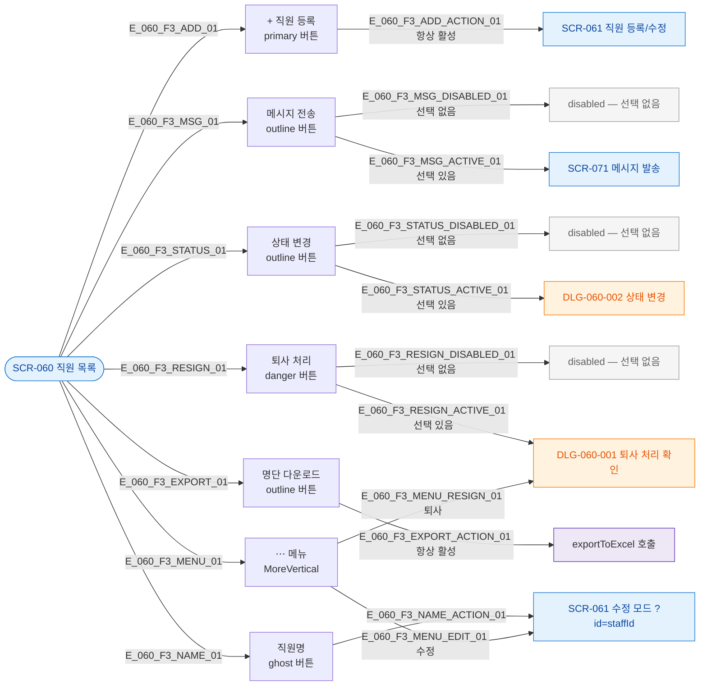

## 1. 목적

SCR-060의 모든 버튼을 노드화하여 각 버튼의 동작과 조건을 명세한다. 버튼별 TC 원천.

## 2. 전제조건

- SCR-060 진입 완료 상태이다.

## 3. 다이어그램

## 4. 엣지 설명 테이블

| 엣지 ID | 버튼 | 조건 | 동작 |
|---------|------|------|------|
| E_060_F3_ADD_ACTION_01 | + 직원 등록 | 항상 활성 | SCR-061 신규 모드 이동 |
| E_060_F3_MSG_DISABLED_01 | 메시지 전송 | selectedRows.size === 0 | disabled |
| E_060_F3_MSG_ACTIVE_01 | 메시지 전송 | selectedRows.size > 0 | SCR-071 이동 |
| E_060_F3_STATUS_DISABLED_01 | 상태 변경 | selectedRows.size === 0 | disabled |
| E_060_F3_STATUS_ACTIVE_01 | 상태 변경 | selectedRows.size > 0 | DLG-060-002 오픈 |
| E_060_F3_RESIGN_DISABLED_01 | 퇴사 처리 | selectedRows.size === 0 | disabled |
| E_060_F3_RESIGN_ACTIVE_01 | 퇴사 처리 | selectedRows.size > 0 | DLG-060-001 오픈 |
| E_060_F3_EXPORT_ACTION_01 | 명단 다운로드 | 항상 활성 | exportToExcel 실행 |
| E_060_F3_NAME_ACTION_01 | 직원명 | 항상 활성 | SCR-061 수정 모드 이동 |
| E_060_F3_MENU_EDIT_01 | ⋯ > 수정 | 항상 | SCR-061 수정 모드 이동 |
| E_060_F3_MENU_RESIGN_01 | ⋯ > 퇴사 | 항상 | DLG-060-001 오픈 |

## 5. TC 후보

| TC ID | 타입 | Given | When | Then |
|-------|------|-------|------|------|
| TC-060-F3-01 | positive | 선택 없음 | 메시지 전송 버튼 확인 | disabled 상태 |
| TC-060-F3-02 | positive | 1명 선택 | 메시지 전송 클릭 | SCR-071 이동 |
| TC-060-F3-03 | positive | 선택 없음 | 퇴사 처리 버튼 확인 | disabled 상태 |
| TC-060-F3-04 | positive | 1명 선택 | 퇴사 처리 클릭 | DLG-060-001 오픈 |
| TC-060-F3-05 | positive | 항상 | + 직원 등록 클릭 | SCR-061 신규 모드 이동 |
| TC-060-F3-06 | positive | 항상 | 명단 다운로드 클릭 | exportToExcel 실행 |
| TC-060-F3-07 | positive | 데이터 있음 | 직원명 클릭 | SCR-061 수정 모드 이동 |
