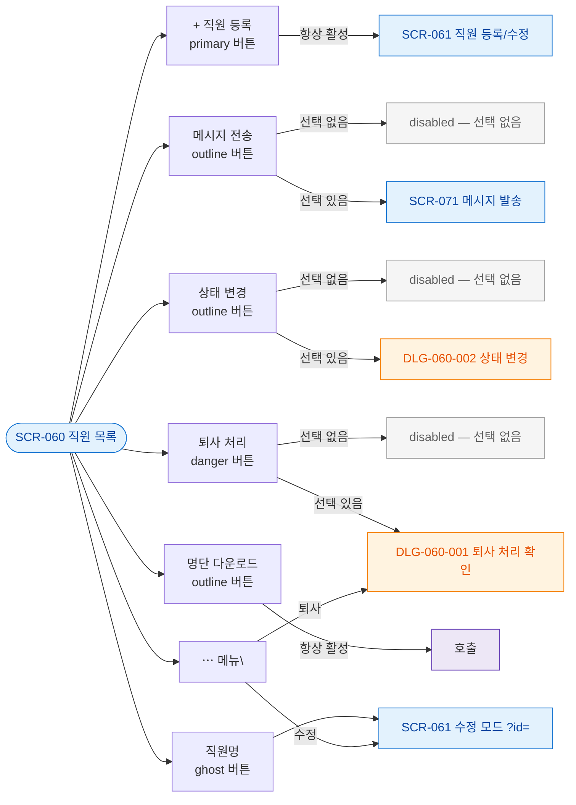

## 1. 목적

SCR-060의 모든 버튼을 노드화하여 각 버튼의 동작과 조건을 명세한다. 버튼별 TC 원천.

## 2. 전제조건

- SCR-060 진입 완료 상태이다.

## 3. 다이어그램

## 4. 엣지 설명 테이블

| 버튼 | 조건 | 동작 | |---------|------|------|------| | | + 직원 등록 | 항상 활성 | SCR-061 신규 모드 이동 | | | 메시지 전송 | === 0 | disabled | | | 메시지 전송 | | SCR-071 이동 | | | 상태 변경 | === 0 | disabled | | | 상태 변경 | | DLG-060-002 오픈 | | | 퇴사 처리 | === 0 | disabled | | | 퇴사 처리 | | DLG-060-001 오픈 | | | 명단 다운로드 | 항상 활성 | 실행 | | | 직원명 | 항상 활성 | SCR-061 수정 모드 이동 | | | ⋯ > 수정 | 항상 | SCR-061 수정 모드 이동 | | | ⋯ > 퇴사 | 항상 | DLG-060-001 오픈 |
