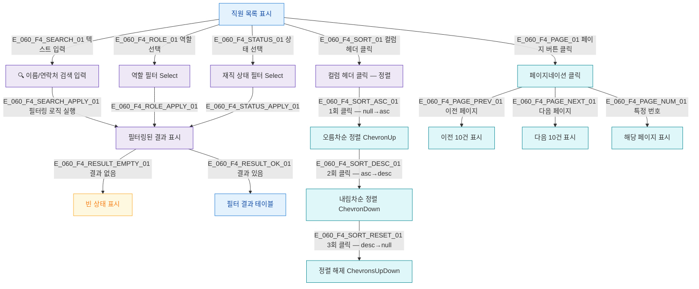

## 1. 목적

SCR-060의 필터/검색/정렬/페이지네이션 조작 흐름을 명세한다. 쿼리 TC 원천.

## 2. 전제조건

- SCR-060 진입 완료, 직원 목록 표시 상태이다.

## 3. 다이어그램

## 4. 엣지 설명 테이블

| 엣지 ID | 출발 | 도착 | 라벨 / 조건 |
|---------|------|------|-------------|
| E_060_F4_SEARCH_01 | 목록 | 검색 입력 | 검색창 텍스트 입력 |
| E_060_F4_SEARCH_APPLY_01 | 검색 입력 | 필터 결과 | 이름 or 연락처 포함 필터링 |
| E_060_F4_ROLE_01 | 목록 | 역할 필터 | 역할 Select 변경 |
| E_060_F4_STATUS_01 | 목록 | 상태 필터 | 재직 상태 Select 변경 |
| E_060_F4_SORT_ASC_01 | 정렬 | 오름차순 | 컬럼 헤더 1회 클릭 |
| E_060_F4_SORT_DESC_01 | 오름차순 | 내림차순 | 컬럼 헤더 2회 클릭 |
| E_060_F4_SORT_RESET_01 | 내림차순 | 정렬 해제 | 컬럼 헤더 3회 클릭 |
| E_060_F4_PAGE_PREV_01 | 페이지 | 이전 | 이전 버튼 |
| E_060_F4_PAGE_NEXT_01 | 페이지 | 다음 | 다음 버튼 |
| E_060_F4_PAGE_NUM_01 | 페이지 | 특정 페이지 | 번호 클릭 |

## 5. TC 후보

| TC ID | 타입 | Given | When | Then |
|-------|------|-------|------|------|
| TC-060-F4-01 | positive | 직원 데이터 존재 | "홍길동" 검색 | 이름 매칭 직원만 표시 |
| TC-060-F4-02 | positive | 직원 데이터 존재 | "010-1234" 검색 | 연락처 매칭 직원만 표시 |
| TC-060-F4-03 | positive | 직원 데이터 존재 | 역할="트레이너" 선택 | 트레이너만 표시 |
| TC-060-F4-04 | positive | 직원 데이터 존재 | 상태="재직" 선택 | 재직 직원만 표시 |
| TC-060-F4-05 | positive | 직원 데이터 존재 | 역할+상태 복합 필터 | 교집합 결과 표시 |
| TC-060-F4-06 | positive | 직원 데이터 존재 | 직원명 컬럼 헤더 1회 클릭 | 오름차순 정렬 |
| TC-060-F4-07 | positive | 오름차순 상태 | 직원명 컬럼 헤더 1회 더 클릭 | 내림차순 정렬 |
| TC-060-F4-08 | positive | 내림차순 상태 | 직원명 컬럼 헤더 1회 더 클릭 | 정렬 해제 |
| TC-060-F4-09 | positive | 11명 이상 직원 | 2페이지 클릭 | 11~20번째 직원 표시 |
| TC-060-F4-10 | positive | 필터 결과 없음 | 없는 이름 검색 | 빈 상태 메시지 표시 |
