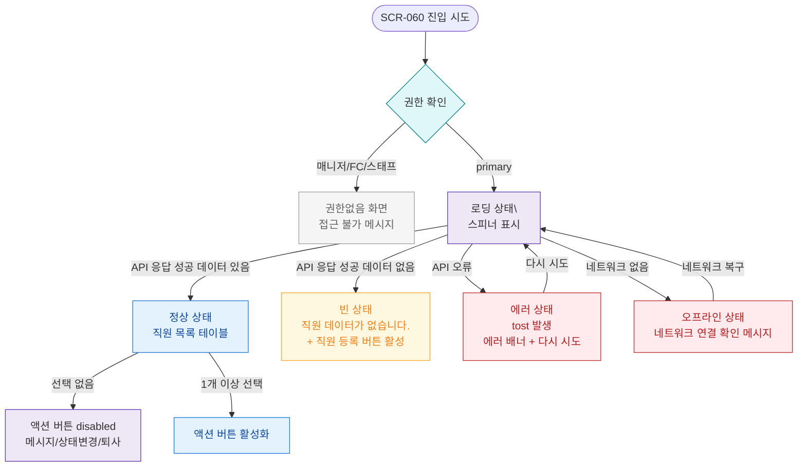

## 1. 목적

SCR-060의 로딩/빈/에러/권한없음/오프라인 등 UI 상태별 분기를 명세한다. UI 상태 TC 원천.

## 2. 전제조건

- SCR-060 진입 시도 상태이다.

## 3. 다이어그램

## 4. 엣지 설명 테이블

| 출발 | 도착 | 조건 | |---------|------|------|------| | | 권한 확인 | 권한없음 | 매니저/FC/스태프 역할 | | | 권한 확인 | 로딩 | primary | | | 로딩 | 정상 | 200 OK, 데이터 있음 | | | 로딩 | 빈 상태 | 200 OK, 데이터 없음 | | | 로딩 | 에러 | API 오류 | | | 로딩 | 오프라인 | 네트워크 없음 | | | 에러 | 로딩 | 다시 시도 | | | 정상 | 선택 없음 | === 0 | | | 정상 | 선택 있음 | |
