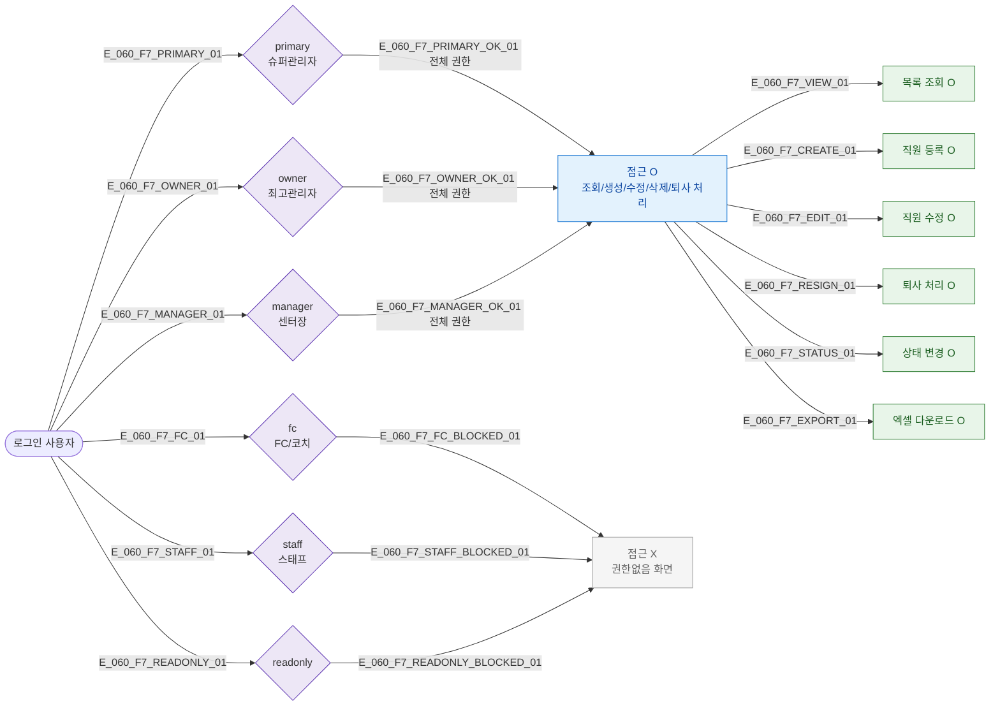

## 1. 목적

SCR-060에서 6개 역할별 접근/액션 가능 범위를 명세한다. RBAC TC 원천.

## 2. 전제조건

- 사용자가 로그인 상태이다.

## 3. 다이어그램

## 4. 엣지 설명 테이블

| 엣지 ID | 역할 | 결과 |
|---------|------|------|
| E_060_F7_PRIMARY_OK_01 | primary | 전체 접근 허용 |
| E_060_F7_OWNER_OK_01 | owner | 전체 접근 허용 |
| E_060_F7_MANAGER_OK_01 | manager | 전체 접근 허용 |
| E_060_F7_FC_BLOCKED_01 | fc | 접근 차단 |
| E_060_F7_STAFF_BLOCKED_01 | staff | 접근 차단 |
| E_060_F7_READONLY_BLOCKED_01 | readonly | 접근 차단 |

## 5. TC 후보

| TC ID | 타입 | Given | When | Then |
|-------|------|-------|------|------|
| TC-060-F7-01 | positive | primary | SCR-060 진입 | 전체 기능 이용 가능 |
| TC-060-F7-02 | positive | owner | SCR-060 진입 | 전체 기능 이용 가능 |
| TC-060-F7-03 | positive | manager | SCR-060 진입 | 전체 기능 이용 가능 |
| TC-060-F7-04 | negative | fc | SCR-060 접근 시도 | 권한없음 화면 |
| TC-060-F7-05 | negative | staff | SCR-060 접근 시도 | 권한없음 화면 |
| TC-060-F7-06 | negative | readonly | SCR-060 접근 시도 | 권한없음 화면 |
