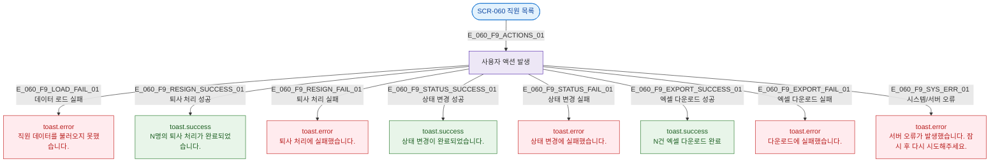

## 1. 목적

SCR-060에서 발생하는 모든 토스트/피드백 메시지의 발생 조건을 명세한다. 피드백 TC 원천.

## 2. 전제조건

- SCR-060 진입 완료 상태이다.

## 3. 다이어그램

## 4. 토스트 목록

| 트리거 | 유형 | 메시지 |
|--------|------|--------|
| 데이터 로드 실패 | error | 직원 데이터를 불러오지 못했습니다. |
| 퇴사 처리 성공 | success | N명의 퇴사 처리가 완료되었습니다. |
| 퇴사 처리 실패 | error | 퇴사 처리에 실패했습니다. |
| 상태 변경 성공 | success | 상태 변경이 완료되었습니다. |
| 상태 변경 실패 | error | 상태 변경에 실패했습니다. |
| 엑셀 다운로드 성공 | success | N건 엑셀 다운로드 완료 |
| 엑셀 다운로드 실패 | error | 다운로드에 실패했습니다. |
| 시스템/서버 오류 | error | 서버 오류가 발생했습니다. 잠시 후 다시 시도해주세요. |

## 5. TC 후보

| TC ID | 타입 | Given | When | Then |
|-------|------|-------|------|------|
| TC-060-F9-01 | exception | owner | API 오류로 데이터 로드 실패 | error 토스트 표시 |
| TC-060-F9-02 | positive | owner, 1명 선택 | 퇴사 처리 성공 | success 토스트 메시지 확인 |
| TC-060-F9-03 | negative | owner, 1명 선택 | 퇴사 처리 API 실패 | error 토스트 표시 |
| TC-060-F9-04 | positive | owner, 1명 선택 | 상태 변경 성공 | success 토스트 표시 |
| TC-060-F9-05 | positive | owner | 엑셀 다운로드 성공 | success 토스트 + 파일 다운로드 |
