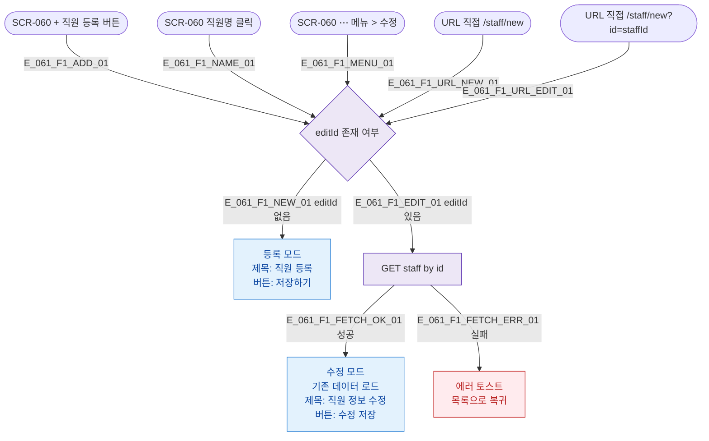

## 1. 목적

SCR-061 직원 등록/수정 화면에 진입할 수 있는 모든 경로를 명세한다.

## 2. 전제조건

- primary/owner/manager 로 로그인 상태이다.

## 3. 다이어그램

## 4. 엣지 설명 테이블

| 엣지 ID | 출발 | 도착 | 조건 |
|---------|------|------|------|
| E_061_F1_ADD_01 | SCR-060 추가 버튼 | 모드 확인 | editId 없음 |
| E_061_F1_NAME_01 | SCR-060 직원명 | 모드 확인 | editId 있음 |
| E_061_F1_NEW_01 | 모드 확인 | 등록 모드 | editId 없음 |
| E_061_F1_EDIT_01 | 모드 확인 | 데이터 조회 | editId 있음 |
| E_061_F1_FETCH_OK_01 | 데이터 조회 | 수정 모드 | 성공 |
| E_061_F1_FETCH_ERR_01 | 데이터 조회 | 에러 | 실패 |

## 5. TC 후보

| TC ID | 타입 | Given | When | Then |
|-------|------|-------|------|------|
| TC-061-F1-01 | positive | owner | + 직원 등록 클릭 | 등록 모드 진입, 제목 "직원 등록" |
| TC-061-F1-02 | positive | owner | 직원명 클릭 | 수정 모드 진입, 기존 데이터 로드 |
| TC-061-F1-03 | positive | owner | /staff/new URL | 등록 모드 진입 |
| TC-061-F1-04 | positive | owner | /staff/new?id=123 URL | 수정 모드 진입 |
| TC-061-F1-05 | exception | owner | 수정 모드 진입 중 API 오류 | 에러 토스트 + 목록 복귀 |
