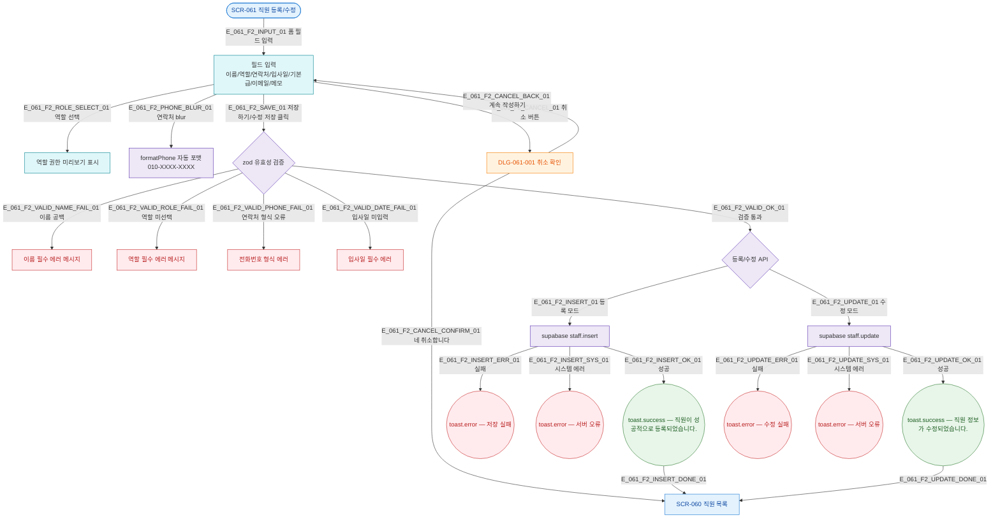

## 1. 목적

SCR-061 정상 시나리오. 폼 입력→검증→저장 흐름. 성공/검증실패/시스템에러 3갈래 분기 강제.

## 2. 전제조건

- SCR-061 진입 완료 상태이다 (등록 또는 수정 모드).

## 3. 다이어그램

## 4. 엣지 설명 테이블

| 엣지 ID | 출발 | 도착 | 조건 |
|---------|------|------|------|
| E_061_F2_ROLE_SELECT_01 | 입력 | 권한 미리보기 | 역할 선택 시 |
| E_061_F2_PHONE_BLUR_01 | 입력 | 포맷 | 연락처 blur |
| E_061_F2_CANCEL_01 | 입력 | DLG-061-001 | 취소 버튼 클릭 |
| E_061_F2_CANCEL_CONFIRM_01 | DLG-061-001 | SCR-060 | 취소 확인 |
| E_061_F2_CANCEL_BACK_01 | DLG-061-001 | 입력 | 계속 작성 |
| E_061_F2_SAVE_01 | 입력 | 검증 | 저장 버튼 클릭 |
| E_061_F2_VALID_NAME_FAIL_01 | 검증 | 에러 | 이름 공백 |
| E_061_F2_VALID_OK_01 | 검증 | API | 전체 검증 통과 |
| E_061_F2_INSERT_OK_01 | INSERT | 성공 토스트 | 성공 |
| E_061_F2_INSERT_ERR_01 | INSERT | 실패 토스트 | 클라이언트 오류 |
| E_061_F2_INSERT_SYS_01 | INSERT | 시스템 토스트 | 서버 오류 |
| E_061_F2_UPDATE_OK_01 | UPDATE | 성공 토스트 | 성공 |

## 5. TC 후보

| TC ID | 타입 | Given | When | Then |
|-------|------|-------|------|------|
| TC-061-F2-01 | positive | 등록 모드, 전체 필수 입력 | 저장하기 클릭 | 등록 성공 토스트 + 목록 이동 |
| TC-061-F2-02 | negative | 등록 모드 | 이름 공백 저장 | 이름 필수 에러 |
| TC-061-F2-03 | negative | 등록 모드 | 역할 미선택 저장 | 역할 필수 에러 |
| TC-061-F2-04 | negative | 등록 모드 | 연락처 형식 오류 저장 | 전화번호 형식 에러 |
| TC-061-F2-05 | positive | 등록 모드 | 연락처 11자리 입력 | 010-XXXX-XXXX 자동 포맷 |
| TC-061-F2-06 | positive | 등록 모드, 역할 선택 | 역할 Select 변경 | 권한 미리보기 박스 표시 |
| TC-061-F2-07 | positive | 수정 모드, 데이터 변경 | 수정 저장 클릭 | 수정 성공 토스트 + 목록 이동 |
| TC-061-F2-08 | positive | 등록 모드, 입력 중 | 취소 → 네 취소합니다 | 목록 이동, 데이터 미저장 |
| TC-061-F2-09 | positive | 취소 모달 | 계속 작성하기 클릭 | 모달 닫힘, 입력 유지 |
| TC-061-F2-10 | exception | 등록 모드 | 저장 중 API 500 | 시스템 에러 토스트 |
