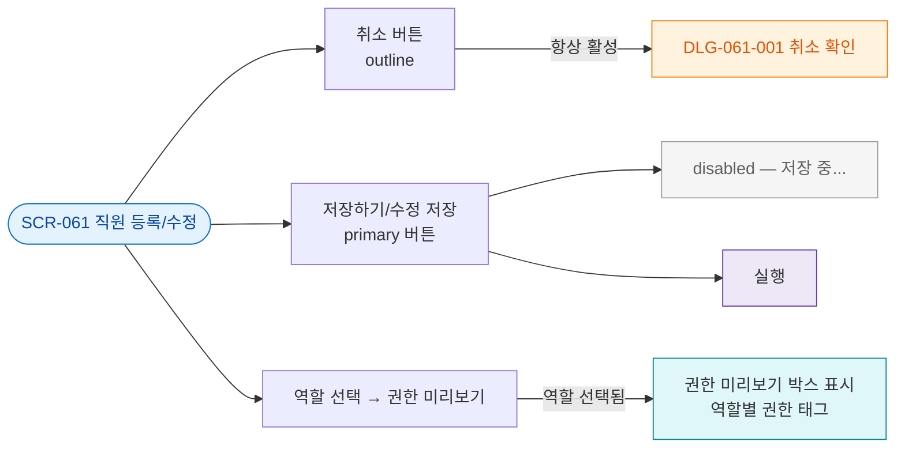

## 1. 목적

SCR-061의 모든 버튼 동작과 조건을 명세한다.

## 2. 다이어그램

## 4. 엣지 설명 테이블

| 버튼 | 조건 | 동작 | |---------|------|------|------| | | 취소 | 항상 활성 | DLG-061-001 오픈 | | | 저장하기 | | disabled 상태 | | | 저장하기 | | 실행 | | | 역할 Select | 역할 선택됨 | 권한 미리보기 표시 |
