## 1. 목적

SCR-061 폼 필드별 입력 및 실시간 검증 흐름. 필터/검색이 없는 폼 화면이므로 필드 검증 플로우로 대체한다.

## 2. 다이어그램

```mermaid
flowchart TD
  FORM([폼 필드 입력])

  FORM -->|E_061_F4_NAME_01| FLD_NAME[이름 필드\ntext 필수]
  FORM -->|E_061_F4_ROLE_01| FLD_ROLE[역할 Select\n필수]
  FORM -->|E_061_F4_PHONE_01| FLD_PHONE[연락처 필드\nformatPhone 필수]
  FORM -->|E_061_F4_DATE_01| FLD_DATE[입사일 DatePicker\n필수]
  FORM -->|E_061_F4_SALARY_01| FLD_SALARY[기본급 number\n선택]
  FORM -->|E_061_F4_EMAIL_01| FLD_EMAIL[이메일 email\n선택]
  FORM -->|E_061_F4_MEMO_01| FLD_MEMO[메모 textarea\n선택]

  FLD_NAME -->|E_061_F4_NAME_EMPTY_01 공백| ERR_NAME[이름 필수 에러]
  FLD_NAME -->|E_061_F4_NAME_OK_01 입력됨| OK_NAME[이름 유효]

  FLD_ROLE -->|E_061_F4_ROLE_EMPTY_01 미선택| ERR_ROLE[역할 필수 에러]
  FLD_ROLE -->|E_061_F4_ROLE_OK_01 선택됨| OK_ROLE[역할 유효 + 권한 미리보기]

  FLD_PHONE -->|E_061_F4_PHONE_FORMAT_01 11자리 입력| FMT_PHONE[010-XXXX-XXXX 자동 포맷]
  FLD_PHONE -->|E_061_F4_PHONE_INVALID_01 형식 오류| ERR_PHONE[전화번호 형식 에러]
  FLD_PHONE -->|E_061_F4_PHONE_OK_01 유효| OK_PHONE[연락처 유효]

  FLD_DATE -->|E_061_F4_DATE_EMPTY_01 미입력| ERR_DATE[입사일 필수 에러]
  FLD_DATE -->|E_061_F4_DATE_OK_01 입력됨| OK_DATE[입사일 유효]

  FLD_EMAIL -->|E_061_F4_EMAIL_INVALID_01 이메일 형식 오류| ERR_EMAIL[이메일 형식 에러]
  FLD_EMAIL -->|E_061_F4_EMAIL_OK_01 유효 또는 공백| OK_EMAIL[이메일 유효/선택사항]

  classDef system fill:#EDE7F6,stroke:#5E35B2
  classDef error  fill:#FFEBEE,stroke:#C62828,color:#B71C1C
  classDef success fill:#E8F5E9,stroke:#2E7D32,color:#1B5E20
  classDef info   fill:#E0F7FA,stroke:#00838F

  class FORM,FLD_NAME,FLD_ROLE,FLD_PHONE,FLD_DATE,FLD_SALARY,FLD_EMAIL,FLD_MEMO,FMT_PHONE system
  class ERR_NAME,ERR_ROLE,ERR_PHONE,ERR_DATE,ERR_EMAIL error
  class OK_NAME,OK_ROLE,OK_PHONE,OK_DATE,OK_EMAIL success
```

## 5. TC 후보

| TC ID | 타입 | Given | When | Then |
|-------|------|-------|------|------|
| TC-061-F4-01 | negative | 등록 모드 | 이름 공백 저장 | 이름 필수 에러 |
| TC-061-F4-02 | negative | 등록 모드 | 역할 미선택 저장 | 역할 필수 에러 |
| TC-061-F4-03 | negative | 등록 모드 | 연락처 "abc" 입력 저장 | 전화번호 형식 에러 |
| TC-061-F4-04 | positive | 등록 모드 | 연락처 "01012345678" 입력 | "010-1234-5678" 자동 포맷 |
| TC-061-F4-05 | negative | 등록 모드 | 이메일 "notanemail" | 이메일 형식 에러 |
| TC-061-F4-06 | positive | 등록 모드 | 이메일 공백 | 에러 없음 (선택사항) |
