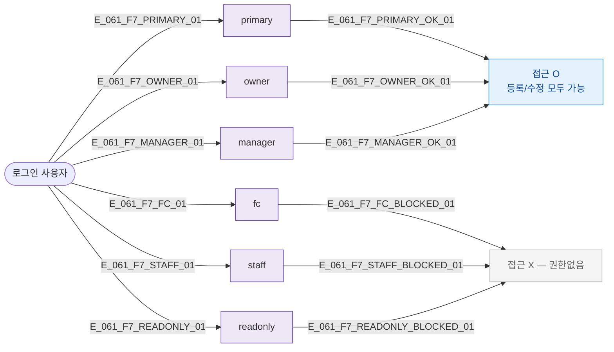

## 1. 목적

SCR-061 접근 및 액션별 역할 분기를 명세한다.

## 2. 다이어그램

## 5. TC 후보

| TC ID | 타입 | Given | When | Then |
|-------|------|-------|------|------|
| TC-061-F7-01 | positive | owner | SCR-061 진입 | 정상 접근 |
| TC-061-F7-02 | negative | fc | SCR-061 접근 | 권한없음 |
| TC-061-F7-03 | negative | staff | SCR-061 접근 | 권한없음 |
