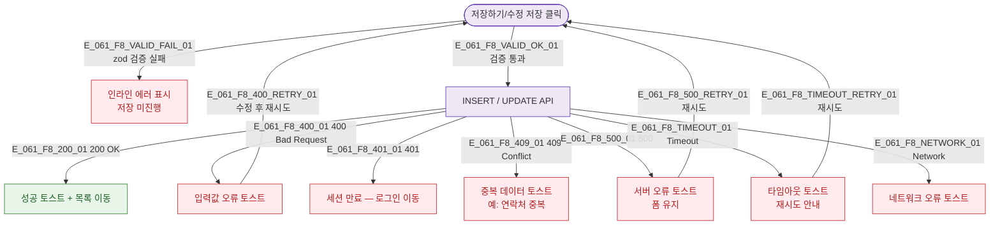

## 1. 목적

SCR-061 폼 저장/수정 시 발생 가능한 에러 분기와 복구 경로를 명세한다.

## 2. 다이어그램

## 5. TC 후보

| TC ID | 타입 | Given | When | Then |
|-------|------|-------|------|------|
| TC-061-F8-01 | negative | 필수 필드 공백 | 저장 클릭 | 인라인 에러, API 미호출 |
| TC-061-F8-02 | exception | 유효 입력 | API 500 | 서버 오류 토스트, 폼 유지 |
| TC-061-F8-03 | exception | 유효 입력 | API timeout | 타임아웃 토스트, 재시도 안내 |
| TC-061-F8-04 | exception | 유효 입력 | 세션 만료 | 로그인 화면 이동 |
