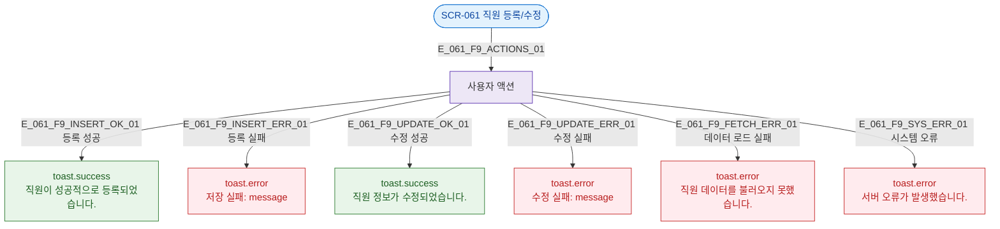

## 1. 목적

SCR-061에서 발생하는 모든 토스트 메시지 조건을 명세한다.

## 2. 다이어그램

## 4. 토스트 목록

| 트리거 | 유형 | 메시지 |
|--------|------|--------|
| 등록 성공 | success | 직원이 성공적으로 등록되었습니다. |
| 등록 실패 | error | 저장 실패: {error.message} |
| 수정 성공 | success | 직원 정보가 수정되었습니다. |
| 수정 실패 | error | 수정 실패: {error.message} |
| 데이터 로드 실패 | error | 직원 데이터를 불러오지 못했습니다. |
| 시스템 오류 | error | 서버 오류가 발생했습니다. |

## 5. TC 후보

| TC ID | 타입 | Given | When | Then |
|-------|------|-------|------|------|
| TC-061-F9-01 | positive | 등록 모드 정상 저장 | 저장 성공 | success 토스트 표시 |
| TC-061-F9-02 | negative | 등록 모드 | API 실패 | error 토스트 표시 |
| TC-061-F9-03 | positive | 수정 모드 정상 저장 | 수정 성공 | success 토스트 표시 |
