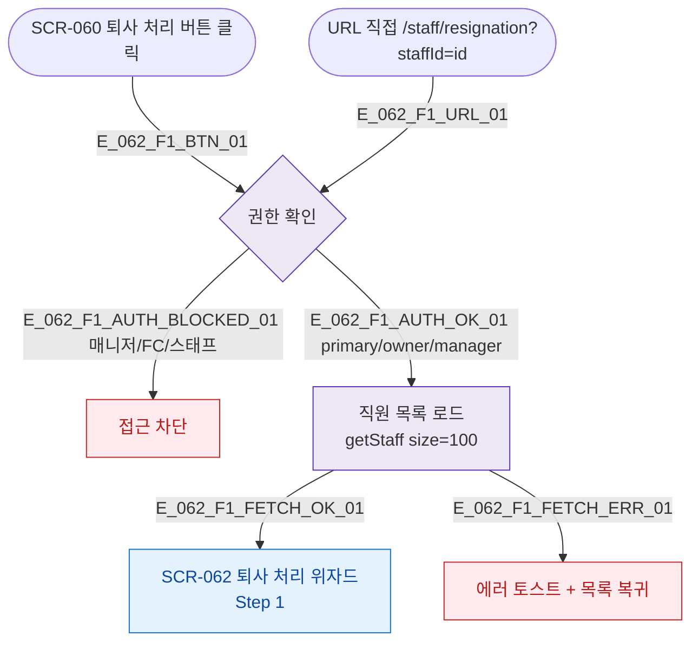

## 1. 목적

SCR-062 직원 퇴사 처리 위자드 진입 경로를 명세한다.

## 2. 전제조건

- primary/owner/manager 로 로그인 상태이다.

## 3. 다이어그램

## 5. TC 후보

| TC ID | 타입 | Given | When | Then |
|-------|------|-------|------|------|
| TC-062-F1-01 | positive | owner, 1명 선택 | 퇴사 처리 버튼 | SCR-062 Step 1 진입 |
| TC-062-F1-02 | negative | fc | /staff/resignation 접근 | 권한없음 |
| TC-062-F1-03 | exception | owner | 직원 목록 로드 실패 | 에러 토스트 |
