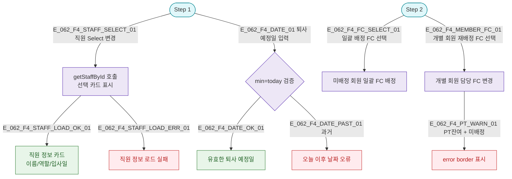

## 1. 목적

SCR-062 각 Step의 Select/검색 조작 흐름. 필터/정렬이 없는 위자드이므로 Step별 선택 플로우로 대체.

## 3. 다이어그램

## 5. TC 후보

| TC ID | 타입 | Given | When | Then |
|-------|------|-------|------|------|
| TC-062-F4-01 | positive | Step 1 | 직원 Select 변경 | 선택 카드 표시 |
| TC-062-F4-02 | negative | Step 1 | 퇴사일에 과거 날짜 입력 | 날짜 오류 메시지 |
| TC-062-F4-03 | positive | Step 2 | 일괄 배정 FC 선택 후 적용 | 전원 배정 |
| TC-062-F4-04 | negative | Step 2, PT잔여 회원 | 재배정 미완료 | error border 표시 |
