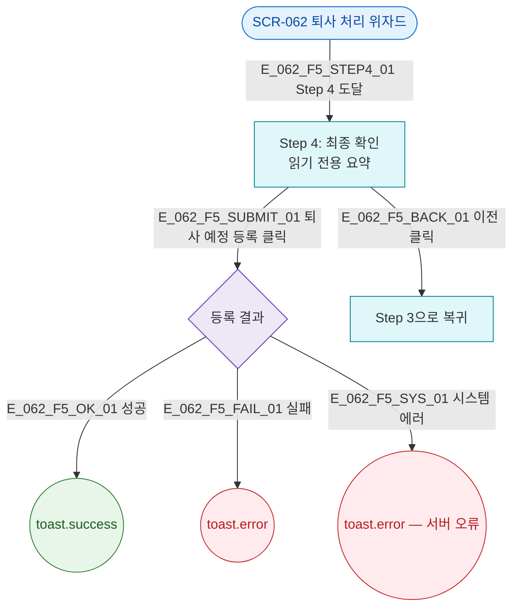

## 1. 목적

SCR-062는 위자드 자체가 전용 페이지이며 별도 모달 없음. Step 4 최종 확인이 실질적 확인 단계.

## 3. 다이어그램

## 5. TC 후보

| TC ID | 타입 | Given | When | Then |
|-------|------|-------|------|------|
| TC-062-F5-01 | positive | Step 4 | 퇴사 예정 등록 | 성공 토스트 |
| TC-062-F5-02 | positive | Step 4 | 이전 클릭 | Step 3 복귀 |
| TC-062-F5-03 | exception | Step 4 | API 500 | 에러 토스트 |
