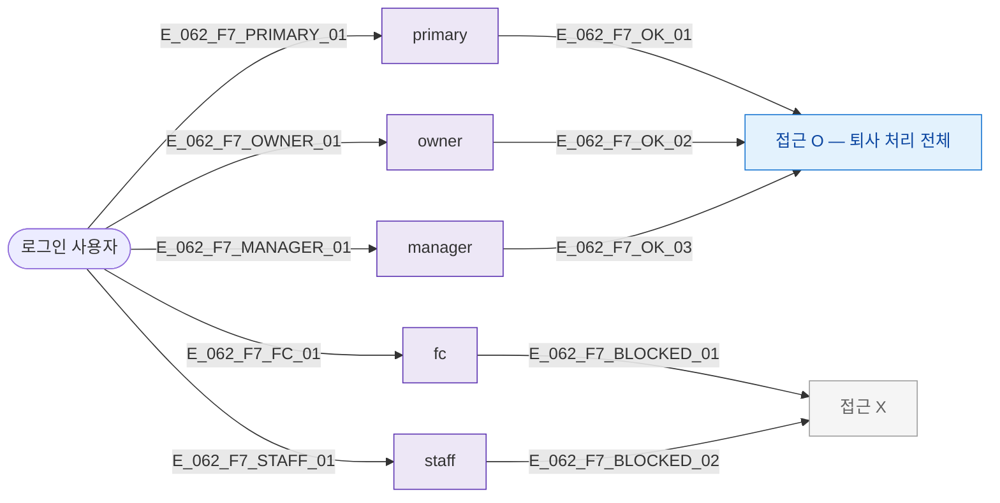

## 1. 목적

SCR-062 역할별 접근 분기를 명세한다.

## 3. 다이어그램

## 5. TC 후보

| TC ID | 타입 | Given | When | Then |
|-------|------|-------|------|------|
| TC-062-F7-01 | positive | owner | 접근 | 정상 |
| TC-062-F7-02 | negative | fc | 접근 시도 | 차단 |
| TC-062-F7-03 | negative | staff | 접근 시도 | 차단 |
