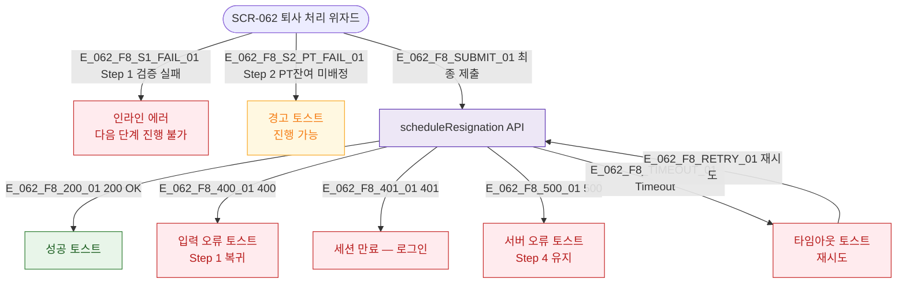

## 1. 목적

SCR-062 위자드 각 단계의 에러 분기와 복구 경로를 명세한다.

## 3. 다이어그램

## 5. TC 후보

| TC ID | 타입 | Given | When | Then |
|-------|------|-------|------|------|
| TC-062-F8-01 | negative | Step 1 | 직원 미선택 | 인라인 에러 |
| TC-062-F8-02 | exception | Step 4 | API 500 | 서버 오류 토스트, Step 4 유지 |
| TC-062-F8-03 | exception | Step 4 | API timeout | 타임아웃 토스트, 재시도 |
