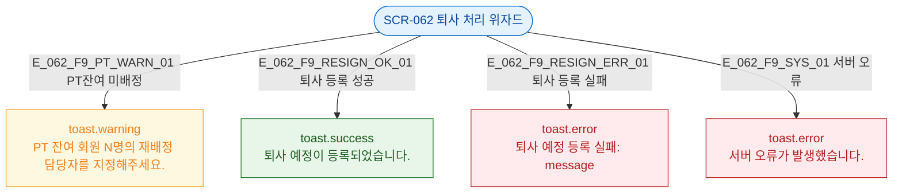

## 1. 목적

SCR-062에서 발생하는 모든 토스트/피드백 조건을 명세한다.

## 3. 다이어그램

## 4. 토스트 목록

| 트리거 | 유형 | 메시지 |
|--------|------|--------|
| PT잔여 미배정 | warning | PT 잔여 회원 N명의 재배정 담당자를 지정해주세요. |
| 퇴사 등록 성공 | success | 퇴사 예정이 등록되었습니다. |
| 퇴사 등록 실패 | error | 퇴사 예정 등록 실패: {message} |
| 서버 오류 | error | 서버 오류가 발생했습니다. |

## 5. TC 후보

| TC ID | 타입 | Given | When | Then |
|-------|------|-------|------|------|
| TC-062-F9-01 | negative | Step 2, PT잔여 미배정 | 다음 | warning 토스트 |
| TC-062-F9-02 | positive | Step 4 | 등록 성공 | success 토스트 |
| TC-062-F9-03 | exception | Step 4 | API 실패 | error 토스트 |
