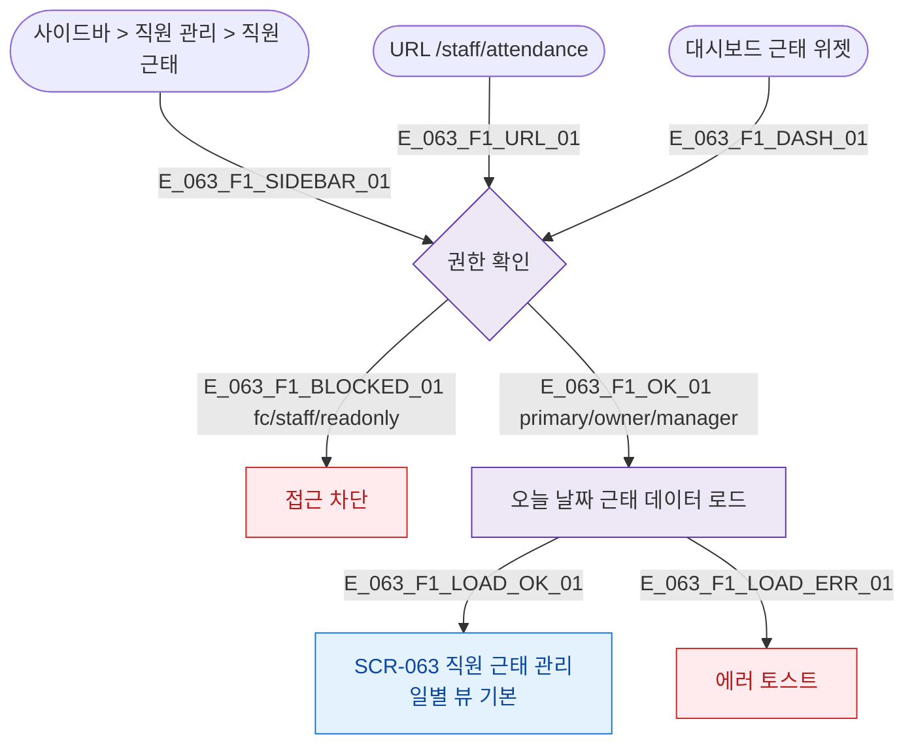

## 1. 목적

SCR-063 직원 근태 관리 화면 진입 경로를 명세한다.

## 3. 다이어그램

## 5. TC 후보

| TC ID | 타입 | Given | When | Then |
|-------|------|-------|------|------|
| TC-063-F1-01 | positive | owner | 사이드바 클릭 | SCR-063 진입, 오늘 근태 표시 |
| TC-063-F1-02 | negative | fc | 접근 시도 | 차단 |
| TC-063-F1-03 | exception | owner | 데이터 로드 실패 | 에러 토스트 |
