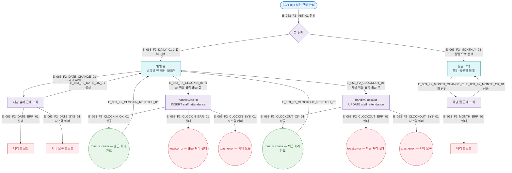

## 1. 목적

SCR-063 일별/월별 뷰 전환 및 출퇴근 기록 흐름. 성공/검증실패/시스템에러 3갈래 분기 강제.

## 3. 다이어그램

## 5. TC 후보

| TC ID | 타입 | Given | When | Then |
|-------|------|-------|------|------|
| TC-063-F2-01 | positive | 일별 뷰, 미출근 직원 | 출근 버튼 | 현재 시각 clockIn 기록, 상태 갱신 |
| TC-063-F2-02 | positive | 일별 뷰, 출근 직원 | 퇴근 버튼 | clockOut + 근무시간 계산 |
| TC-063-F2-03 | positive | 일별 뷰 | 날짜 변경 | 해당 날짜 데이터 재조회 |
| TC-063-F2-04 | positive | 일별 뷰 | 월별 요약 탭 | 월별 집계 표시 |
| TC-063-F2-05 | positive | 월별 뷰 | 월 변경 | 해당 월 데이터 재조회 |
| TC-063-F2-06 | exception | 일별 뷰 | 출근 API 500 | 서버 오류 토스트 |
| TC-063-F2-07 | positive | 09:15 출근 | 출근 처리 | 상태 "지각" 표시 |
