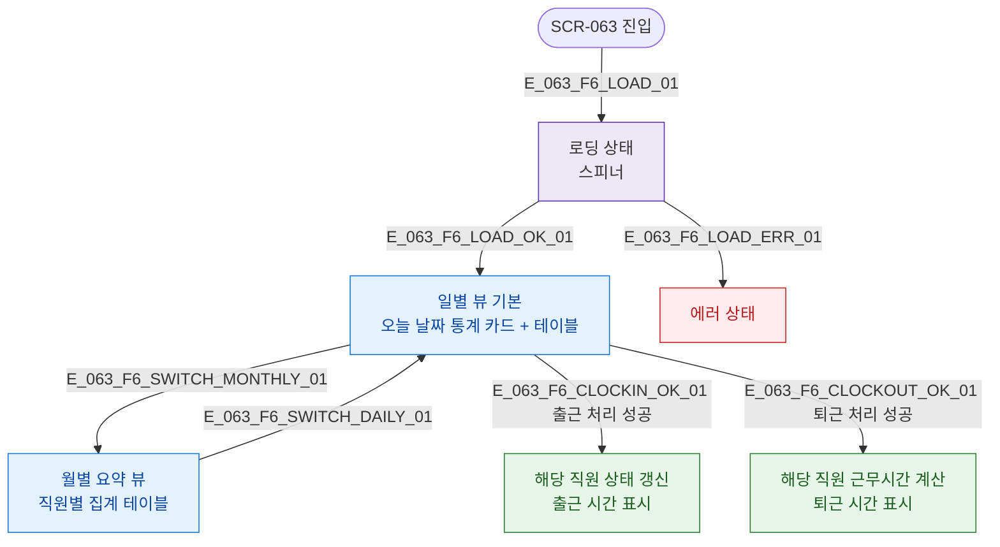

## 1. 목적

SCR-063의 로딩/일별/월별/에러 UI 상태를 명세한다.

## 3. 다이어그램

## 5. TC 후보

| TC ID | 타입 | Given | When | Then |
|-------|------|-------|------|------|
| TC-063-F6-01 | positive | 진입 | 로드 완료 | 일별 뷰 + 오늘 통계 카드 |
| TC-063-F6-02 | positive | 일별 뷰 | 출근 처리 성공 | 해당 행 상태 갱신 |
| TC-063-F6-03 | positive | 일별 뷰 | 탭 전환 | 월별 요약 표시 |
