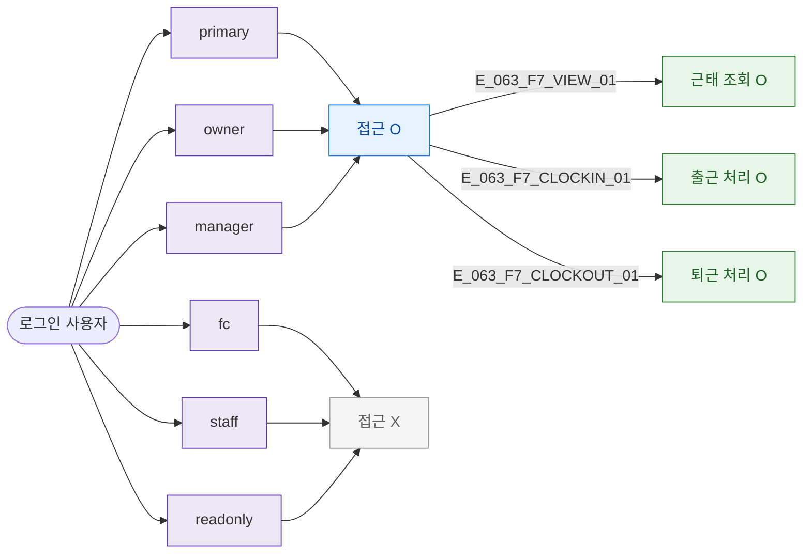

## 1. 목적

SCR-063 역할별 접근 분기 명세.

## 3. 다이어그램

## 5. TC 후보

| TC ID | 타입 | Given | When | Then |
|-------|------|-------|------|------|
| TC-063-F7-01 | positive | owner | 접근 | 정상 |
| TC-063-F7-02 | negative | fc | 접근 | 차단 |
