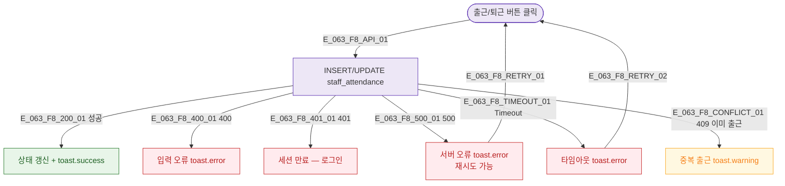

## 1. 목적

SCR-063 출퇴근 API 에러 분기와 복구 경로 명세.

## 3. 다이어그램

## 5. TC 후보

| TC ID | 타입 | Given | When | Then |
|-------|------|-------|------|------|
| TC-063-F8-01 | exception | 출근 버튼 | API 500 | 서버 오류 토스트 |
| TC-063-F8-02 | exception | 출근 버튼 | 이미 출근 기록 있음 | 중복 경고 토스트 |
| TC-063-F8-03 | exception | 출근 버튼 | 세션 만료 | 로그인 화면 |
