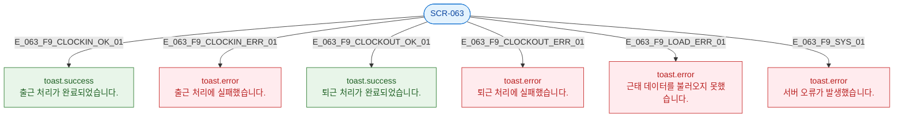

## 1. 목적

SCR-063 토스트 발생 조건 전수 명세.

## 3. 다이어그램

## 4. 토스트 목록

| 트리거 | 유형 | 메시지 |
|--------|------|--------|
| 출근 성공 | success | 출근 처리가 완료되었습니다. |
| 출근 실패 | error | 출근 처리에 실패했습니다. |
| 퇴근 성공 | success | 퇴근 처리가 완료되었습니다. |
| 퇴근 실패 | error | 퇴근 처리에 실패했습니다. |
| 데이터 로드 실패 | error | 근태 데이터를 불러오지 못했습니다. |
| 서버 오류 | error | 서버 오류가 발생했습니다. |
