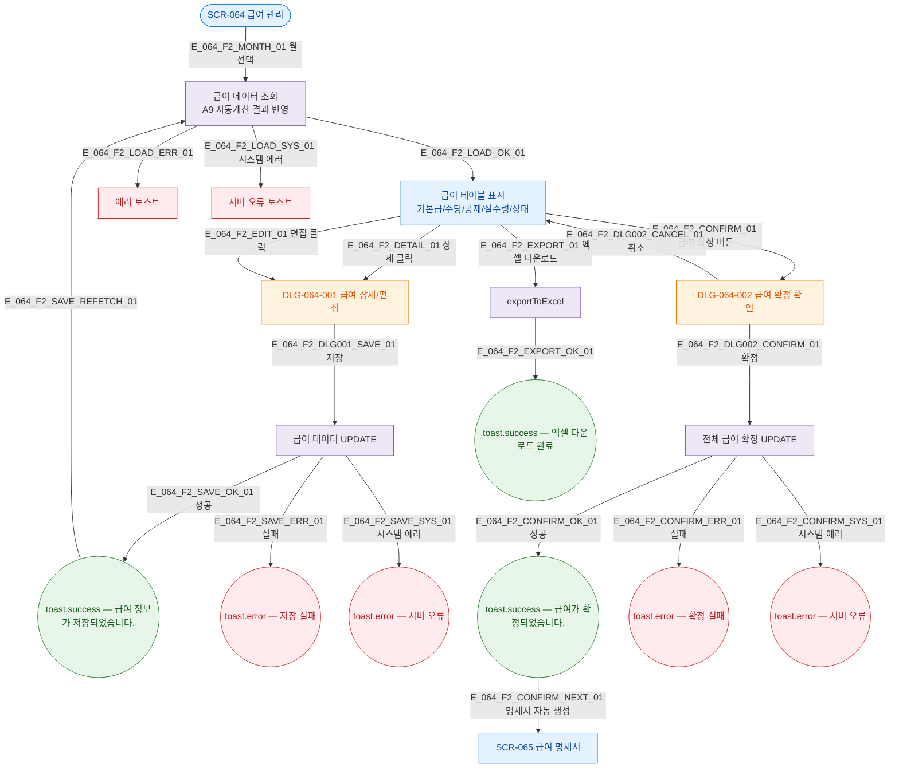

## 1. 목적

SCR-064 급여 조회→개별 편집→전체 확정 흐름. A9 자동계산 연결. X08 시퀀스 참조. 성공/검증실패/시스템에러 3갈래 분기 강제.

## 3. 다이어그램

## 5. TC 후보

| TC ID | 타입 | Given | When | Then |
|-------|------|-------|------|------|
| TC-064-F2-01 | positive | owner | 월 선택 변경 | 해당 월 급여 데이터 재조회 |
| TC-064-F2-02 | positive | owner | 편집 클릭 | DLG-064-001 오픈 |
| TC-064-F2-03 | positive | DLG-064-001 오픈 | 수당 조정 후 저장 | 저장 성공 토스트 + 재조회 |
| TC-064-F2-04 | positive | owner | 급여 확정 | DLG-064-002 오픈 |
| TC-064-F2-05 | positive | DLG-064-002 | 확정 | 확정 성공 + 명세서 자동 생성 |
| TC-064-F2-06 | exception | 저장 중 | API 500 | 서버 오류 토스트 |
