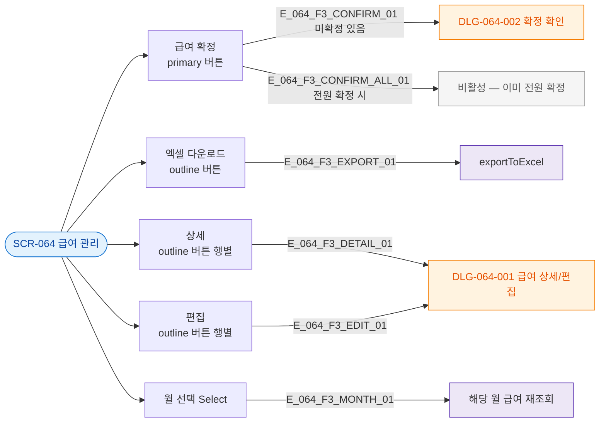

## 3. 다이어그램

## 5. TC 후보

| TC ID | 타입 | Given | When | Then |
|-------|------|-------|------|------|
| TC-064-F3-01 | positive | 미확정 존재 | 급여 확정 | DLG-064-002 오픈 |
| TC-064-F3-02 | positive | 행 | 상세 클릭 | DLG-064-001 오픈 |
| TC-064-F3-03 | positive | 항상 | 엑셀 다운로드 | exportToExcel |
| TC-064-F3-04 | positive | 월 변경 | Select 변경 | 해당 월 재조회 |
