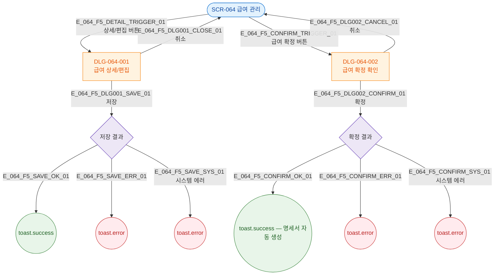

## 3. 다이어그램

## 5. TC 후보

| TC ID | 타입 | Given | When | Then |
|-------|------|-------|------|------|
| TC-064-F5-01 | positive | 행 | 상세 클릭 | DLG-064-001 오픈 |
| TC-064-F5-02 | positive | DLG-064-001 | 취소 | 닫힘 |
| TC-064-F5-03 | positive | DLG-064-001 | 저장 성공 | 성공 토스트 |
| TC-064-F5-04 | positive | 급여 확정 | 확정 성공 | 성공 토스트 + 명세서 생성 |
