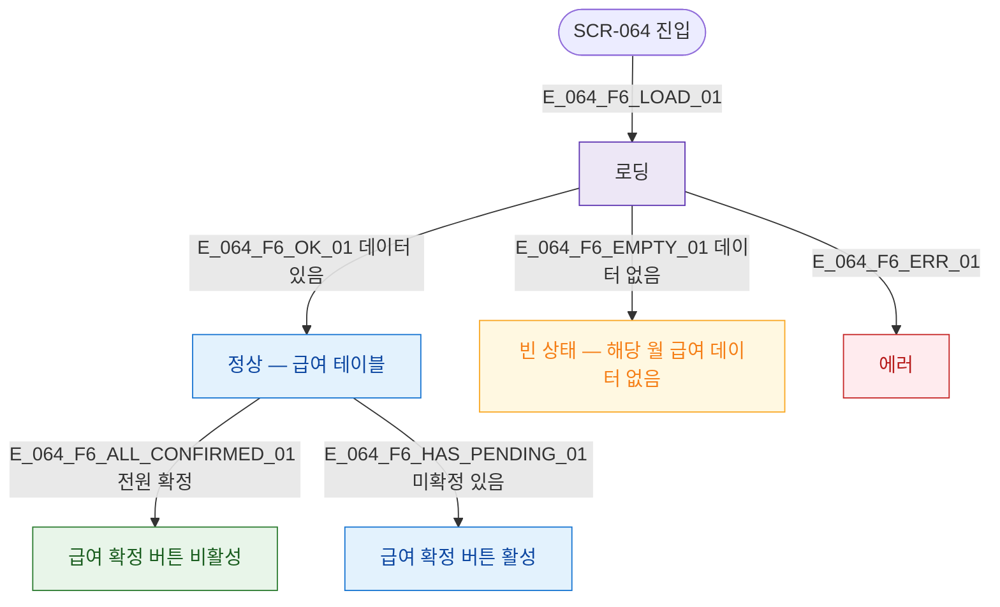

## 3. 다이어그램

## 5. TC 후보

| TC ID | 타입 | Given | When | Then |
|-------|------|-------|------|------|
| TC-064-F6-01 | positive | 진입 | 로드 완료 | 급여 테이블 표시 |
| TC-064-F6-02 | positive | 전원 확정 상태 | 확인 | 확정 버튼 비활성 |
| TC-064-F6-03 | positive | 미확정 존재 | 확인 | 확정 버튼 활성 |
