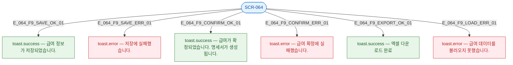

## 3. 다이어그램

## 4. 토스트 목록

| 트리거 | 유형 | 메시지 |
|--------|------|--------|
| 급여 저장 성공 | success | 급여 정보가 저장되었습니다. |
| 급여 저장 실패 | error | 저장에 실패했습니다. |
| 급여 확정 성공 | success | 급여가 확정되었습니다. 명세서가 생성됩니다. |
| 급여 확정 실패 | error | 급여 확정에 실패했습니다. |
| 엑셀 다운로드 | success | 엑셀 다운로드 완료 |
| 데이터 로드 실패 | error | 급여 데이터를 불러오지 못했습니다. |
