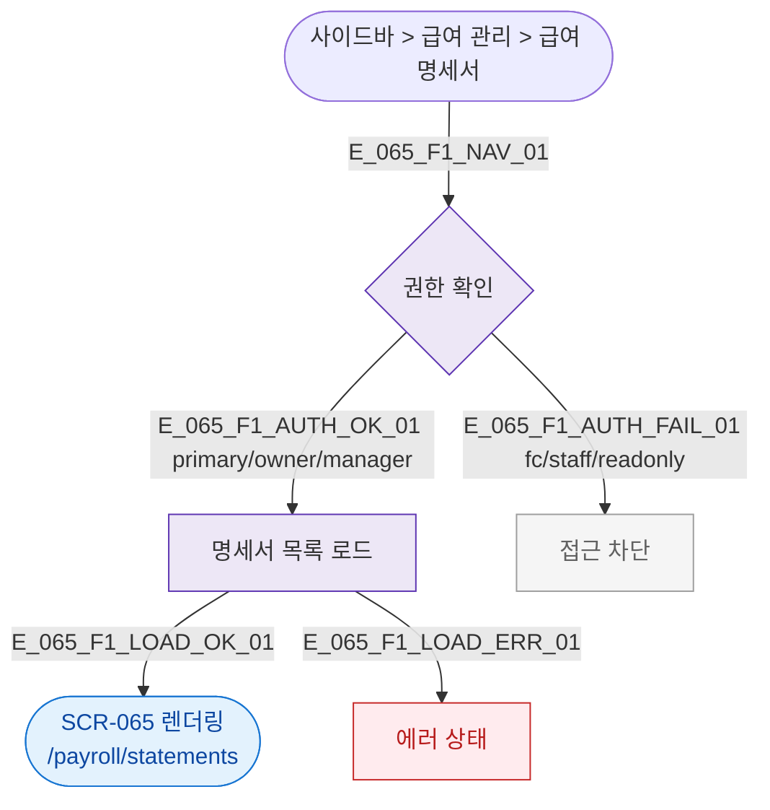

## 3. 다이어그램

## 5. TC 후보

| TC ID | 타입 | Given | When | Then |
|-------|------|-------|------|------|
| TC-065-F1-01 | positive | owner | /payroll/statements 진입 | 명세서 목록 렌더링 |
| TC-065-F1-02 | negative | fc | 접근 시도 | 접근 차단 |
