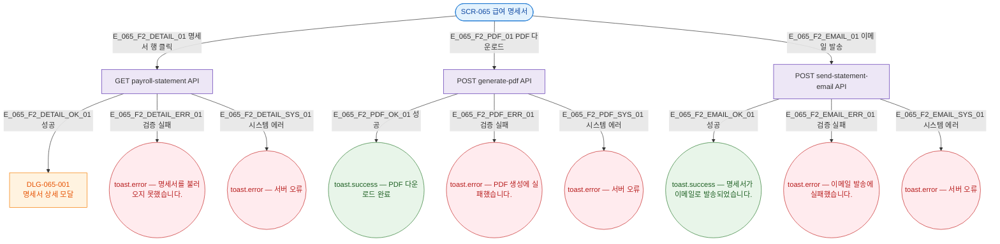

## 3. 다이어그램

## 5. TC 후보

| TC ID | 타입 | Given | When | Then |
|-------|------|-------|------|------|
| TC-065-F2-01 | positive | 명세서 목록 | 행 클릭 | DLG-065-001 오픈 |
| TC-065-F2-02 | positive | 명세서 존재 | PDF 다운로드 | PDF 생성 + 성공 토스트 |
| TC-065-F2-03 | positive | 명세서 존재 | 이메일 발송 | 발송 성공 토스트 |
| TC-065-F2-04 | exception | 명세서 행 클릭 | API 500 | 서버 오류 토스트 |
