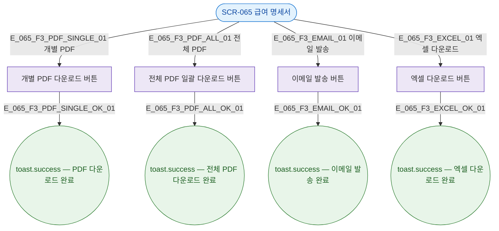

## 3. 다이어그램

## 5. TC 후보

| TC ID | 타입 | Given | When | Then |
|-------|------|-------|------|------|
| TC-065-F3-01 | positive | 명세서 존재 | 개별 PDF 버튼 | PDF 다운로드 성공 토스트 |
| TC-065-F3-02 | positive | 명세서 목록 | 전체 PDF 버튼 | 전체 PDF 일괄 다운로드 |
| TC-065-F3-03 | positive | 명세서 존재 | 이메일 발송 | 발송 성공 토스트 |
| TC-065-F3-04 | positive | 명세서 목록 | 엑셀 다운로드 | 엑셀 파일 다운로드 |
