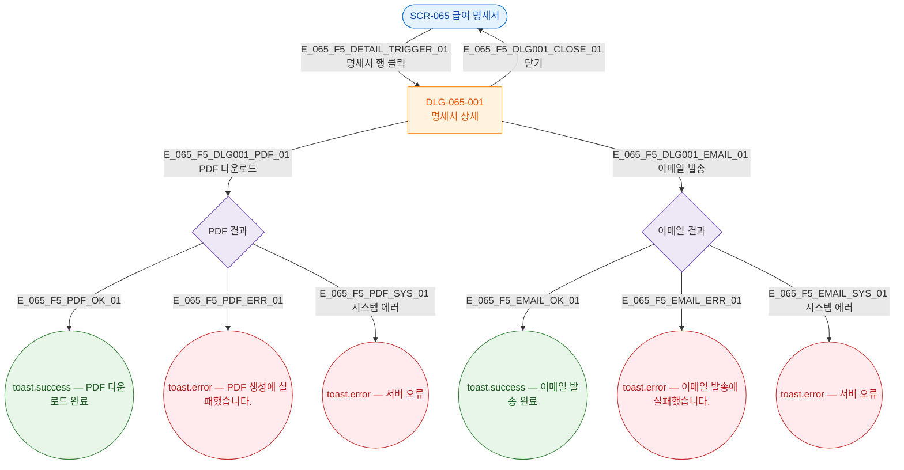

## 3. 다이어그램

## 5. TC 후보

| TC ID | 타입 | Given | When | Then |
|-------|------|-------|------|------|
| TC-065-F5-01 | positive | 명세서 목록 | 행 클릭 | DLG-065-001 오픈 |
| TC-065-F5-02 | positive | DLG-065-001 | 닫기 | 모달 닫힘 |
| TC-065-F5-03 | positive | DLG-065-001 | PDF 다운로드 | 성공 토스트 |
| TC-065-F5-04 | positive | DLG-065-001 | 이메일 발송 | 발송 성공 토스트 |
