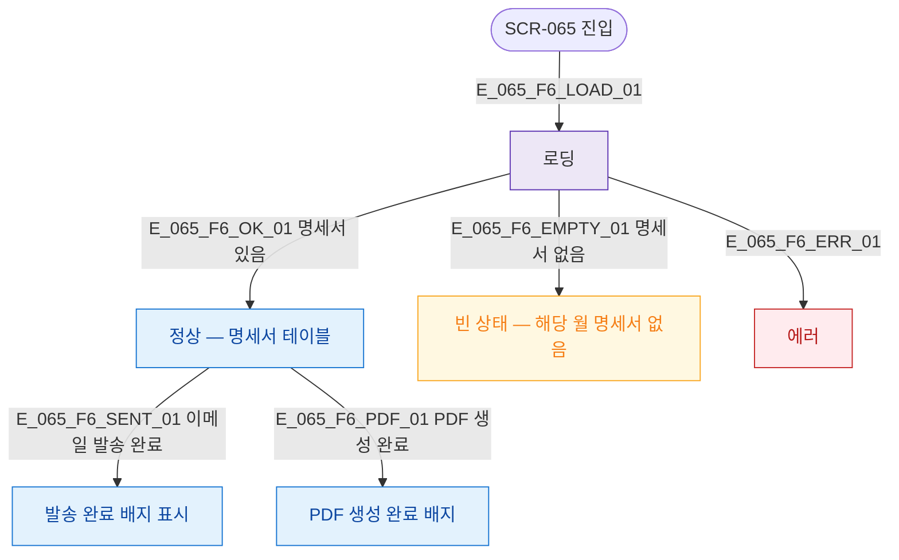

## 3. 다이어그램

## 5. TC 후보

| TC ID | 타입 | Given | When | Then |
|-------|------|-------|------|------|
| TC-065-F6-01 | positive | 진입 | 로드 완료 | 명세서 테이블 표시 |
| TC-065-F6-02 | positive | 해당 월 명세서 없음 | 로드 완료 | 빈 상태 메시지 표시 |
| TC-065-F6-03 | exception | 진입 | API 오류 | 에러 상태 표시 |
