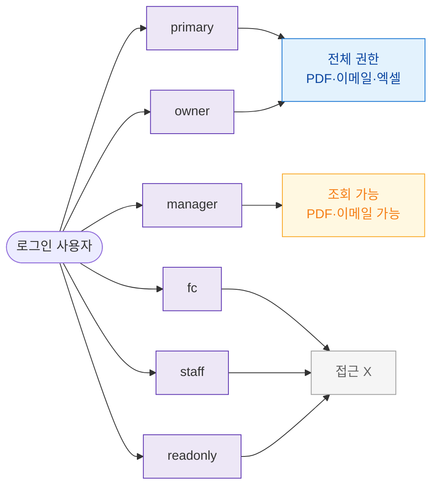

## 3. 다이어그램

## 5. TC 후보

| TC ID | 타입 | Given | When | Then |
|-------|------|-------|------|------|
| TC-065-F7-01 | positive | owner | 명세서 접근 | 전체 기능 허용 |
| TC-065-F7-02 | negative | fc | 접근 시도 | 차단 |
